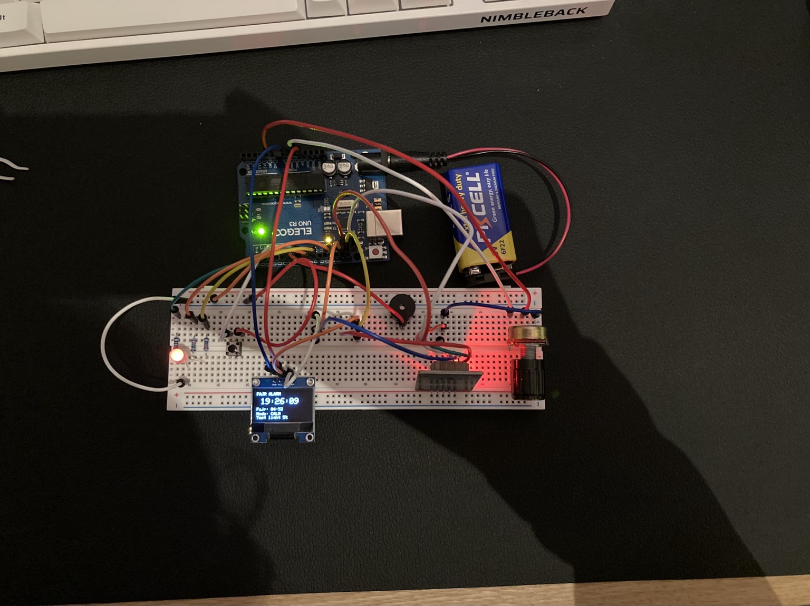
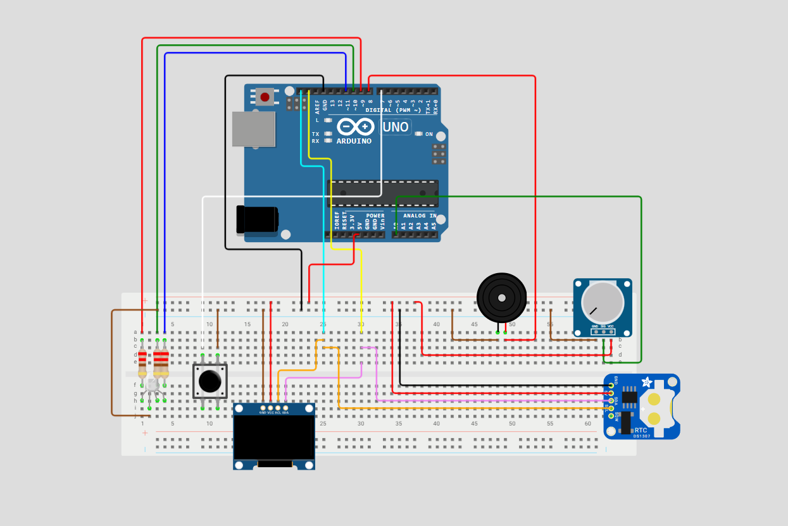
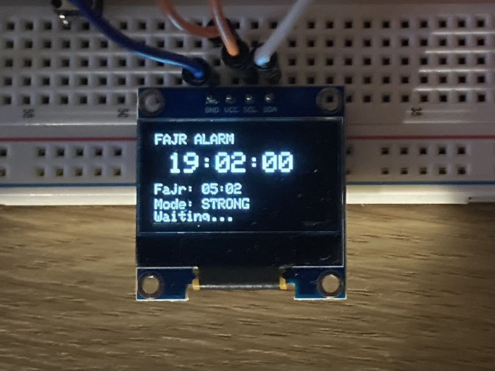
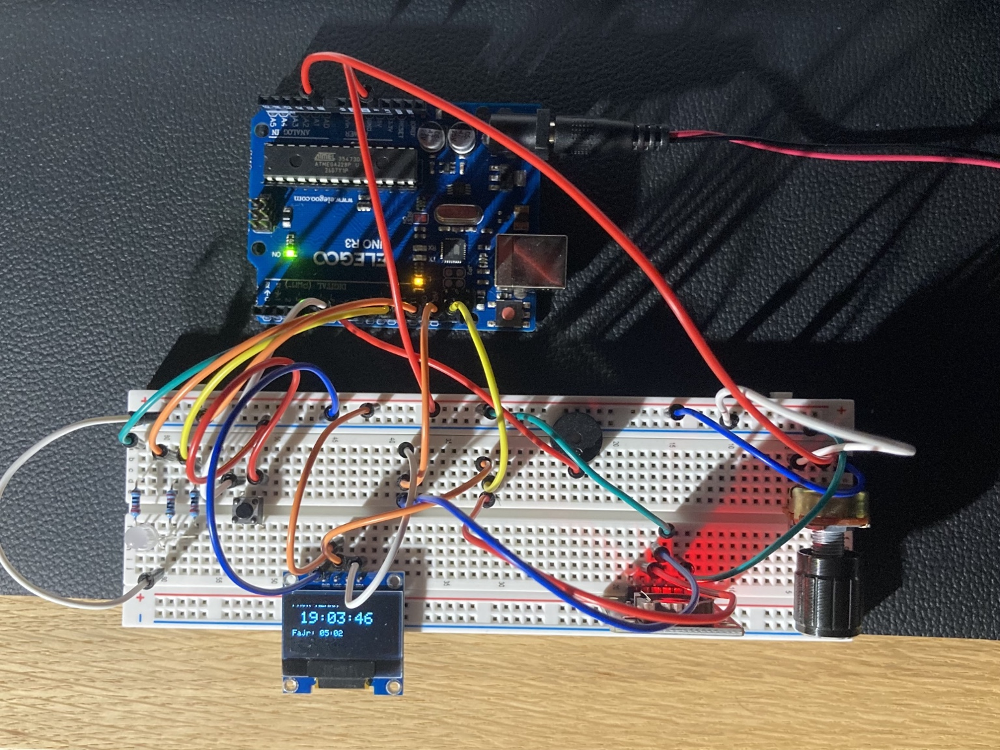
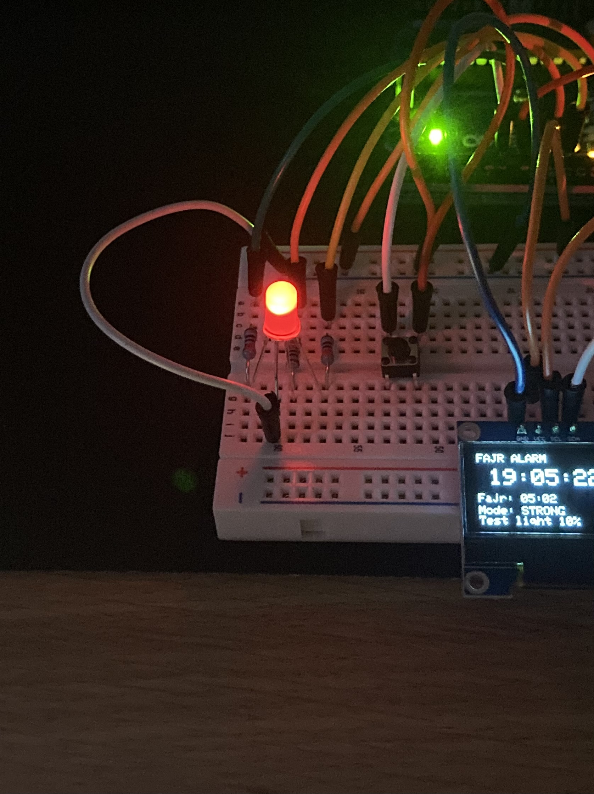

# Smart Dawn Prayer Alarm ⏰

An Arduino-based smart Fajr alarm and nightlight designed to provide a gradual wake-up experience for the dawn prayer.

## 🚀 Overview
The project uses a **DS1307 real-time clock**, **SSD1306 OLED display**, **RGB LED**, **passive buzzer**, **push button**, and **potentiometer**. It automatically calculates the daily Fajr time for **Manchester, UK** using the **Muslim World League (MWL)** prayer-time calculation method and applies UK GMT/BST adjustment.

One minute before Fajr, the RGB LED gradually brightens from darkness into a warm amber glow. At Fajr, the buzzer alarm starts and the LED changes to a slow breathing effect.



### Features

- Automatic daily Fajr-time calculation using the PrayerTimes library
- Manchester, UK location preset
- Muslim World League (MWL) calculation method
- Automatic UK GMT/BST adjustment
- DS1307 RTC timekeeping
- 0.96-inch 128x64 SSD1306 I2C OLED display
- One-minute PWM sunrise fade from off to warm amber
- Smooth breathing-light effect after Fajr
- Three selectable alarm patterns: **Calm**, **Medium**, and **Strong**
- 10k potentiometer for alarm-mode selection
- Push button to stop the alarm
- Non-blocking alarm timing using `millis()`
- Built-in one-minute test mode for demonstrations

## 📍Location, Time and Fajr Calculation

The sketch is preset for Manchester, UK:

```cpp
const float latitude = 53.4808;
const float longitude = -2.2426;
```

The prayer-time calculation method is:

```cpp
CalculationMethods::MWL
```

**MWL does not mean Manchester time.** Manchester provides the geographic location, while MWL is the convention used by the PrayerTimes library to calculate Fajr.

The sketch also contains UK GMT/BST logic so the calculated Fajr time follows the UK clock through the year.

To use the project in another city, change the latitude and longitude and review the time-zone/DST logic for that location.

## 🛠️ Hardware Requirments

| Component | Purpose |
|---|---|
| Arduino Uno R3 | Main microcontroller |
| DS1307 RTC module | Keeps the current date and time |
| 0.96-inch 128x64 SSD1306 I2C OLED | Displays current time, Fajr time and alarm status |
| 4-pin common-cathode RGB LED | Sunrise and breathing light |
| 3 x 220 ohm resistors | RGB LED current limiting |
| Passive buzzer | Alarm sound |
| 10k potentiometer | Selects alarm mode |
| Push button | Stops the alarm |
| Breadboard and jumper wires | Prototype connections |

### Pin Configurations

| Device | Arduino Uno connection |
|---|---|
| RGB Red | D9 through 220 ohm resistor |
| RGB Green | D10 through 220 ohm resistor |
| RGB Blue | D11 through 220 ohm resistor |
| RGB common cathode | GND |
| Passive buzzer + | D8 |
| Passive buzzer - | GND |
| Stop button | D7 to GND using `INPUT_PULLUP` |
| Potentiometer wiper | A0 |
| Potentiometer outer pins | 5V and GND |
| OLED SDA | SDA |
| OLED SCL | SCL |
| RTC SDA | SDA |
| RTC SCL | SCL |
| OLED / RTC VCC | 5V |
| OLED / RTC GND | GND |

The OLED and RTC share the same **I2C bus**, so both use the Arduino's SDA and SCL lines. The OLED is configured at address `0x3C`, while the DS1307 normally uses address `0x68`.

## Circuit Schematic



## Project Photos

### OLED interface



### Prototype hardware layout



### Sunrise light



## Software and Libraries

The project uses:

- `Wire.h` - I2C communication
- `RTClib` - DS1307 RTC interface
- `PrayerTimes` by Adnan Saab - Fajr calculation
- `Adafruit_GFX` - graphics support
- `Adafruit_SSD1306` - OLED driver
- `math.h` - smooth breathing-light calculation

Install the required external libraries through the Arduino IDE Library Manager before compiling.

## How It Works

1. The Arduino reads the current date and time from the DS1307 RTC.
2. The sketch determines the UK GMT/BST offset for the date.
3. The PrayerTimes library calculates that day's Fajr time using Manchester coordinates and the MWL method.
4. One minute before Fajr, PWM gradually increases the RGB LED brightness to create a warm amber sunrise effect.
5. At Fajr, the selected buzzer pattern begins and the RGB LED enters a smooth breathing animation.
6. Pressing the stop button silences the buzzer and prevents the alarm from retriggering on the same day.

The alarm patterns use non-blocking timing, allowing the OLED, controls, lighting and alarm logic to continue running together.

## Alarm Modes

The potentiometer selects one of three alarm patterns:

| Potentiometer reading | Mode |
|---|---|
| 0-340 | Calm |
| 341-681 | Medium |
| 682-1023 | Strong |

## Test Mode

The uploaded GitHub version is configured for normal operation:

```cpp
const bool TEST_MODE = false;
```

For a quick demonstration, temporarily change it to:

```cpp
const bool TEST_MODE = true;
```

In test mode, the sunrise sequence begins immediately and the simulated Fajr alarm starts after one minute.

## RTC Setup

The main sketch deliberately does **not** call `rtc.adjust(...)` during normal startup, so uploading or restarting the program does not overwrite the RTC time.

Set the DS1307 clock separately when first configuring the module and keep its backup coin-cell battery installed so it can retain time when the Arduino is powered off.

## Skills Demonstrated

This project demonstrates Arduino development, embedded C/C++, I2C communication, PWM control, RTC integration, OLED interfacing, analog and digital inputs, circuit prototyping, non-blocking timing, debugging and system integration.

## License

This project is released under the [MIT License](LICENSE).

Third-party Arduino libraries used by this project remain subject to their own licences.
